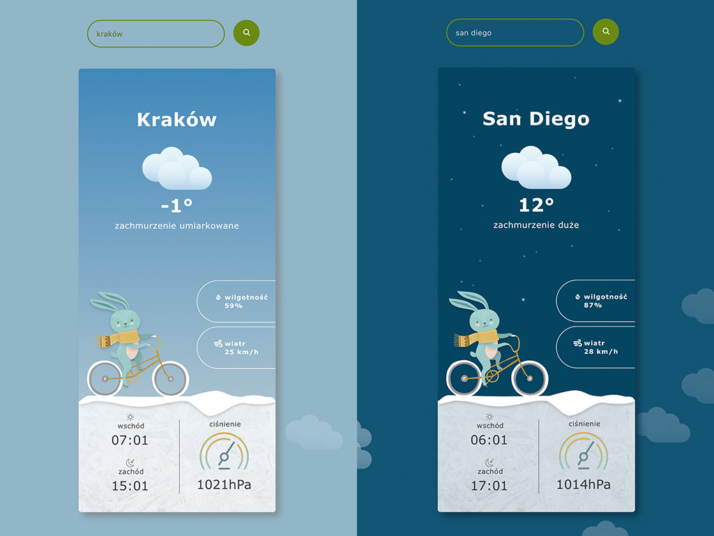

# Weather App

Application shows weather conditions for specific location. Built with React, Typescript, Node, Redux, Express.
Fetching data from OpenWeather API.

## To get started

- clone repository with `git clone`
- go to the project directory `cd`
- install dependecies `npm install`
- create .env file with API_KEY= `YOUR API KEY`
- start backend server `npm run start:backend`
- start frontend `npm start`
